# node-red-contrib-hourglass
`node-red-contrib-hourglass` is a highly versatile stopwatch node to measure ***time differences*** as a duration between a start and an end instant of time. 
Measuring can be stopped (paused) and restarted (resumed) many times including a split time option. A reset function presets the time count value to zero. These are the typical functionalities of a stopwatch.

Additionally an ***alarm functionality*** is implemented which emits a special `msg` at a definable instant of time. Several alarms may be used.

Also, the node persists all required information between restarts of Node-RED to the file system, so you don't need to worry about recovery of your data.
  
One common case of using this node is calculation of the time when some device is working (*operating hour counters 'OHC'*). In addition it also can alert you when it's time to do some maintenance work or change life-limited parts.
Another typical use case is the measuring of time durations (e.g. signal pulse widths, process durations, motion sensor presence times, etc.).  
  
**Fig. 1:** Node appearance

<a name="installation"></a>
## Installation

<a name="installation_in_node-red"></a>
### In Node-RED (preferred)
* Via Manage Palette -> Search for "node-red-contrib-hourglass"

<a name="installation_in_a_shell"></a>
### In a shell
* go to the Node-RED installation folder, e.g.: `~/.node-red`
* run `npm install node-red-contrib-hourglass`

<a name="usage"></a>
## Usage

<a name="node_configuration"></a>
### Node Configuration

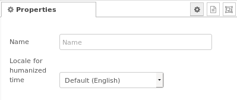  
**Fig. 2:** Node properties

Node configuration is quite simple. You only have to set the language to localize the output `elapsed.human`(see below) and the nodes status message (see Fig. 1: "a few seconds"). If you do not use this, you can omit the node configuration.

<a name="time_measuring"></a>
### Time measuring function ###
The time measuring covers the functionality of a typical stopwatch.
<a name="input_time_measuring"></a>
#### Inputs for time measuring function ####

Every input `msg` should have a **command** property, otherwise an error is issued (see [Error handling](#error_handling)). Supported commands are:
- **start** - starts (or resumes) time measuring  
- **stop** - stops (or pauses) time measuring  
- **pause** - pauses time measuring. Synonym of **stop**  
- **resume** - resumes time measuring. Synonym of **start**  
- **toggle** - switches over between running and stopped time measuring  
- **reset** - resets measured value to 00:00. In the case of a running time measuring the value  continues to count from 00:00  
- **status** - reports the actual status of the measured value. Output properties see section [Output](#output). This command is typically used for split times or to read out the time values after a stopped measuring.  

Remark: Alarm commands are described in the [alarm section](#input_alarm_handling).  

An example for an input `msg` object is as follows:

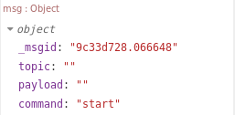

**Fig. 3:** Input `msg` object (example *start* command)


<a name="output_time_measuring"></a>
#### Output properties for time measuring function ####
The `node-red-contrib-hourglass` node contains the following output properties within its sent `msg` objects: 
* `command` - give the last received command
* `started` - gives the status of the time measuring, specifies whether measuring is actually active
* `elapsed` - gives time values as an own sub-object (details see below)

In the basic mode the node only emits a `msg` at a *status* command. 
An extended mode exists, where the output `msg` is send at every command (see [Extended status message mode](#extended_status)).  

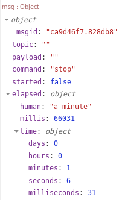

**Fig. 4:** Output `msg` object


The output property `elapsed` contains a sub-object with the following properties:
* `elapsed.human` - human representation of elapsed time (like '2 days'). These strings are localized.  
* `elapsed.millis` - time in milliseconds, specifies the time elapsed since measuring was started.  
* `elapsed.time` - has sub-properties of days/hours/minutes/seconds/milliseconds for elapsed time.  

In the output example shown in the previous Fig. 4, these `msg` object properties contain a *stopped* state ("started: false"), a last command as a *status* command and the *elapsed time* of about 74 seconds.

The basic timer operation is shown in the following figure: In the node internally there is a counter which is controlled via the several commands. The value given in the elapsed object is changed by the *status* command.

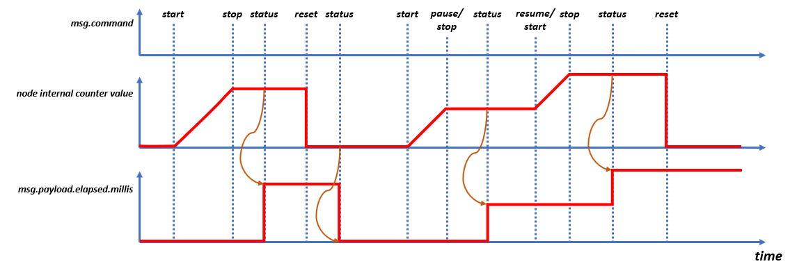
**Fig. 5:** Basic timer operation 


<a name="extended_status"></a>
#### Extended status message mode ####
In some cases it is more convenient to get the elapsed time value directly with an according command, without an extra *status* command. Therefore the *extended status message mode* exists.  
Using this mode, the output `msg` is emitted in the case of every valid command, i.e. not only at the *status* command.

This mode is selected by using the command property `msg.status` set to true in a command `msg`. If the command `msg` contains no status property, the basic mode is active (for compatibility, acts as before).

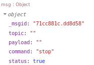

**Fig. 6:** Input `msg` object in extended status message mode (example *stop* command)

An inject node for manually tesing this mode could look like this:  
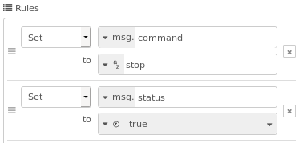

**Fig. 7:** Input inject node configuration for extended status message mode  

The extended status message mode timer operation is shown in the following figure: In the node internally there is a counter which is controlled via the several commands. The value given in the elapsed object is changed by every command. See differences to Fig. 5.

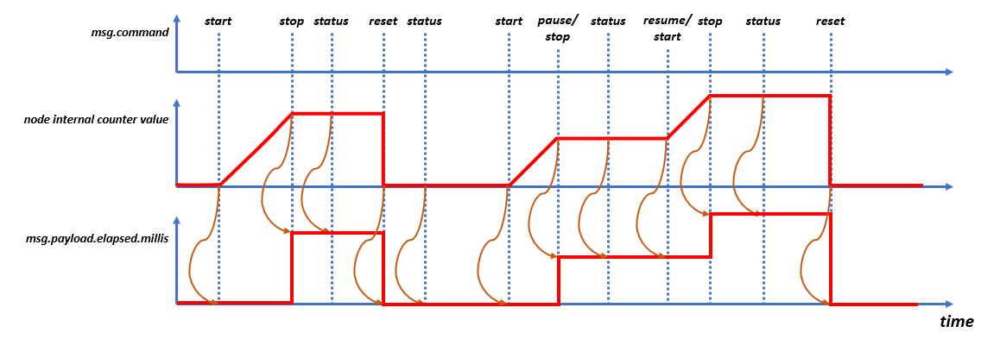
**Fig. 8:** Extended status message mode operation 

Possible use cases for this mode are: 
* Measuring a pulse width, only using a *start* and a *stop* command. The *stop* command gives the result.
* Measuring directly consecuting time durations where every duration shall have its own duration value (i.e. eacht duration measuring start at time counter '0'). This can be achieved using the *reset* while the time measuring keeps running.
* Add several time pieces to measured total times. This can be achieved by using the *toggle* command to start/stop the measuring. At every toggle you get the actual total sum time.


<a name="alarm_handling"></a>
### Alarm handling ###
The alarm functionality covers the ability to set/remove several alarms. Generally there are no limitations of the number of active alarms within the node.  
The time reference of the alarms relates to the node internal timer value, i.e. there is no relationship to the system time (e.g. UTC time). The internal time counts with the according start/stop commands. 
For an explanation see Fig. 9: The programmed timer values are compared to the node internal counter value to determine the alarm time.

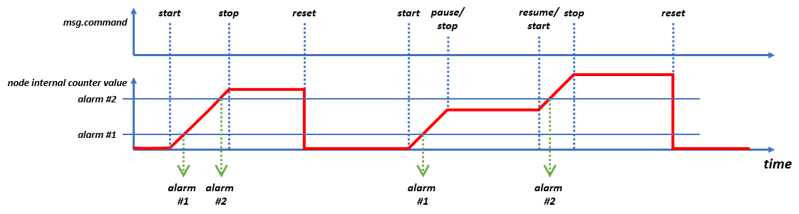
**Fig. 9:** Basic alarm handling 


<a name="input_alarm_handling"></a>
#### Inputs for alarm handling ####
Alarms are controlled via input `msg` objects. Supported commands are:
- **alarm** - adds a new alarm to the node (NOTE: Alarms are not persisted and recovered after restart of Node-RED).  
- **remove-alarms** - cancels and removes all alarms


Input properties for this command are:  

`payload` - text representation of the time when alarm should be triggered. Possible formats are:  
  - `8:00` - for hours with minutes  
  - `9:30:30` - for hours with minutes and seconds  
  - `7.00:00:00` - for days with time  
  - `P1Y2M3DT3H5M42S` - for years/month/days/hours/minutes/seconds
  - for more options you could check [moment.js](#https://momentjs.com/docs/#/durations/) docs  

Especially the last option is very flexible, a few examples:
- `P1Y2M3DT3H5M42S`: 1 year, 2 months, 30 days, 3 hours, 5 minutes, 42 seconds
- `PT8H15M`: 8 hours, 15 minutes
- `PT1M`: 1 minute
- `P1M`: 1 month

`recurrent` - optional, use *true* to send alarm event periodically, default period is the same as alarm time specified by
payload property  

`period` - optional, to specify period of recurrent event if it differs from the alarm time (the same format is used)  

<a name="output_alarm_handling"></a>
#### Outputs for alarm handling ####

The output `msg.payload` when an alarm is fired is the same as the `msg.payload` that was used to add the alarm plus extra properties used in the *status* command.  
The following Fig. 10 shows an example of an output of a cyclic 5 seconds alarm with identification "PT5S".

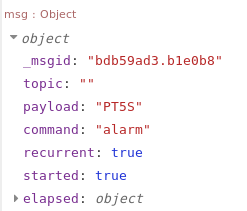

**Fig. 10:** `msg` output of alarm object


### Node status ###
The nodes status shows 
* an active time count with a green dot (see Fig. 10, left node) and the message of the actual elapsed time, 
* a paused/stopped timer with a grey circle (see Fig. 10, right node) with the message of the actual elapsed time.  
* an alarm with a blue dot and a message *"Alarm ... message "*
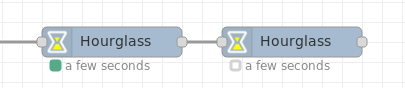

**Fig. 10:** `Hourglass` node status


<a name="error_handling"></a>
## Error handling ## 
The node emits the following error messages, which may be catched via the `catch` node.
Errors are signaled via an error message with a payload string giving the error cause.

The following error messages may occur: 
- "Not running" - occurs if the node is in *stopped* state and an input command *stop* or *pause* is received
- "Already running" - occurs if the node is in *running* state and an input command *start* or *resume* is received
- "Unknown command: *"command"* - occurs when an unknown (invalid) command is received
- "Alarm *"alarm time"* already exists" - occurs when an alarm is already set at the desired alarm time
- "Overdue alarm" - occurs if an alarm is set but the nodes internal time is already ahead the alarm time

The errors may be catched with the `catch` node.


<a name="examples"></a>
## Examples ##

<a name="basic_time_measuring_example"></a>
### Basic time measuring example (start, stop, reset, status) ###
This example shows how to use the basic commands *start*, *stop*, *reset* and *status*.  
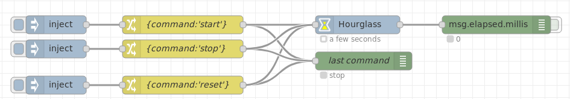

**Fig. 12:** `Hourglass` basic example 


```json
[{"id":"92109e0a.88d96","type":"hourglass","z":"26a14c0c.360194","name":"","humanizeLocale":"","x":751,"y":80,"wires":[["f8480416.0850d"]]},{"id":"5a0a72af.5c5fc4","type":"change","z":"26a14c0c.360194","name":"{command:'reset'}","rules":[{"t":"set","p":"command","pt":"msg","to":"reset","tot":"str"}],"action":"","property":"","from":"","to":"","reg":false,"x":464,"y":180,"wires":[["5f57def2.775bb","92109e0a.88d96"]]},{"id":"cfff0e2d.ada0e8","type":"change","z":"26a14c0c.360194","name":"{command:'start'}","rules":[{"t":"set","p":"command","pt":"msg","to":"start","tot":"str"}],"action":"","property":"","from":"","to":"","reg":false,"x":462,"y":80,"wires":[["5f57def2.775bb","92109e0a.88d96"]]},{"id":"a0a2d80e.88f7d","type":"change","z":"26a14c0c.360194","name":"{command:'stop'}","rules":[{"t":"set","p":"command","pt":"msg","to":"stop","tot":"str"}],"action":"","property":"","from":"","to":"","reg":false,"x":462,"y":120,"wires":[["5f57def2.775bb","92109e0a.88d96"]]},{"id":"f8480416.0850d","type":"debug","z":"26a14c0c.360194","name":"","active":true,"tosidebar":true,"console":false,"tostatus":true,"complete":"elapsed.millis","targetType":"msg","x":981,"y":80,"wires":[]},{"id":"5f57def2.775bb","type":"debug","z":"26a14c0c.360194","name":"last command","active":false,"tosidebar":false,"console":false,"tostatus":true,"complete":"command","targetType":"msg","x":761,"y":140,"wires":[]},{"id":"5d200463.e6e644","type":"inject","z":"26a14c0c.360194","name":"","topic":"","payload":"","payloadType":"str","repeat":"","crontab":"","once":false,"onceDelay":0.1,"x":250,"y":120,"wires":[["a0a2d80e.88f7d"]]},{"id":"894f06df.59219","type":"inject","z":"26a14c0c.360194","name":"","topic":"","payload":"","payloadType":"str","repeat":"","crontab":"","once":false,"onceDelay":0.1,"x":250,"y":180,"wires":[["5a0a72af.5c5fc4"]]},{"id":"f8935576.4a4ae","type":"inject","z":"26a14c0c.360194","name":"","topic":"","payload":"","payloadType":"str","repeat":"","crontab":"","once":false,"onceDelay":0.1,"x":250,"y":80,"wires":[["cfff0e2d.ada0e8"]]},{"id":"6384eb1d.90bca4","type":"inject","z":"26a14c0c.360194","name":"","topic":"","payload":"","payloadType":"str","repeat":"","crontab":"","once":false,"onceDelay":0.1,"x":250,"y":220,"wires":[["5bb3a7b5.cb8b9"]]},{"id":"5bb3a7b5.cb8b9","type":"change","z":"26a14c0c.360194","name":"{command:'status'}","rules":[{"t":"set","p":"command","pt":"msg","to":"status","tot":"str"}],"action":"","property":"","from":"","to":"","reg":false,"x":462,"y":220,"wires":[["92109e0a.88d96","5f57def2.775bb"]]}]
```  
**Fig. 13:** `Hourglass` node example flow

<a name="alarm_handling_example"></a>
### Alarm handling example ###

This example shows how to use the basic commands *start*, *stop*, *reset* and *status*.  
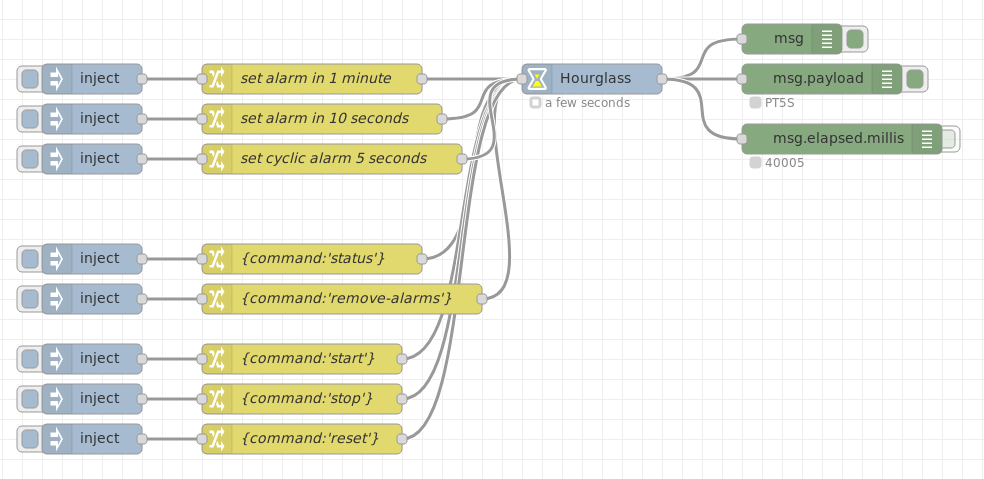

**Fig. 14:** `Hourglass` alarm example 


```json
[{"id":"76ad33c8.52d1e4","type":"hourglass","z":"26a14c0c.360194","name":"","humanizeLocale":"","x":750,"y":1280,"wires":[["48e7b8f6.d2b7e8","621f5071.e97ee","f84d53.0be15ab"]]},{"id":"8cb1ef4e.8dff38","type":"inject","z":"26a14c0c.360194","name":"","topic":"","payload":"","payloadType":"str","repeat":"","crontab":"","once":false,"onceDelay":0.1,"x":250,"y":1280,"wires":[["7b8c6063.f76678"]]},{"id":"7b8c6063.f76678","type":"change","z":"26a14c0c.360194","name":"set alarm in 1 minute","rules":[{"t":"set","p":"command","pt":"msg","to":"alarm","tot":"str"},{"t":"set","p":"payload","pt":"msg","to":"PT1M","tot":"str"}],"action":"","property":"","from":"","to":"","reg":false,"x":470,"y":1280,"wires":[["76ad33c8.52d1e4"]]},{"id":"5d7657e2.d07258","type":"change","z":"26a14c0c.360194","name":"{command:'status'}","rules":[{"t":"set","p":"command","pt":"msg","to":"status","tot":"str"}],"action":"","property":"","from":"","to":"","reg":false,"x":470,"y":1460,"wires":[["76ad33c8.52d1e4"]]},{"id":"650a4dc5.2cb5c4","type":"inject","z":"26a14c0c.360194","name":"","topic":"","payload":"","payloadType":"str","repeat":"","crontab":"","once":false,"onceDelay":0.1,"x":250,"y":1460,"wires":[["5d7657e2.d07258"]]},{"id":"48e7b8f6.d2b7e8","type":"debug","z":"26a14c0c.360194","name":"","active":true,"tosidebar":true,"console":false,"tostatus":true,"complete":"true","targetType":"full","x":950,"y":1240,"wires":[]},{"id":"621f5071.e97ee","type":"debug","z":"26a14c0c.360194","name":"","active":true,"tosidebar":true,"console":false,"tostatus":true,"complete":"payload","targetType":"msg","x":980,"y":1280,"wires":[]},{"id":"2b06cd04.bb404a","type":"inject","z":"26a14c0c.360194","name":"","topic":"","payload":"","payloadType":"str","repeat":"","crontab":"","once":false,"onceDelay":0.1,"x":250,"y":1500,"wires":[["9a8f22de.fee2e8"]]},{"id":"9a8f22de.fee2e8","type":"change","z":"26a14c0c.360194","name":"{command:'remove-alarms'}","rules":[{"t":"set","p":"command","pt":"msg","to":"remove-alarms","tot":"str"}],"action":"","property":"","from":"","to":"","reg":false,"x":500,"y":1500,"wires":[["76ad33c8.52d1e4"]]},{"id":"4516e2d8.3c1304","type":"inject","z":"26a14c0c.360194","name":"","topic":"","payload":"","payloadType":"str","repeat":"","crontab":"","once":false,"onceDelay":0.1,"x":250,"y":1560,"wires":[["66e38264.6658dc"]]},{"id":"66e38264.6658dc","type":"change","z":"26a14c0c.360194","name":"{command:'start'}","rules":[{"t":"set","p":"command","pt":"msg","to":"start","tot":"str"}],"action":"","property":"","from":"","to":"","reg":false,"x":460,"y":1560,"wires":[["76ad33c8.52d1e4"]]},{"id":"a94a0d94.066868","type":"change","z":"26a14c0c.360194","name":"{command:'stop'}","rules":[{"t":"set","p":"command","pt":"msg","to":"stop","tot":"str"}],"action":"","property":"","from":"","to":"","reg":false,"x":460,"y":1600,"wires":[["76ad33c8.52d1e4"]]},{"id":"6e5c7e92.30574","type":"inject","z":"26a14c0c.360194","name":"","topic":"","payload":"","payloadType":"str","repeat":"","crontab":"","once":false,"onceDelay":0.1,"x":250,"y":1600,"wires":[["a94a0d94.066868"]]},{"id":"c16d066d.091528","type":"inject","z":"26a14c0c.360194","name":"","topic":"","payload":"","payloadType":"str","repeat":"","crontab":"","once":false,"onceDelay":0.1,"x":250,"y":1320,"wires":[["bbb6f84a.a40458"]]},{"id":"bbb6f84a.a40458","type":"change","z":"26a14c0c.360194","name":"set alarm in 10 seconds","rules":[{"t":"set","p":"command","pt":"msg","to":"alarm","tot":"str"},{"t":"set","p":"payload","pt":"msg","to":"PT10S","tot":"str"}],"action":"","property":"","from":"","to":"","reg":false,"x":480,"y":1320,"wires":[["76ad33c8.52d1e4"]]},{"id":"76dbf5ec.8779ec","type":"change","z":"26a14c0c.360194","name":"{command:'reset'}","rules":[{"t":"set","p":"command","pt":"msg","to":"reset","tot":"str"}],"action":"","property":"","from":"","to":"","reg":false,"x":460,"y":1640,"wires":[["76ad33c8.52d1e4"]]},{"id":"a96d28f8.b75238","type":"inject","z":"26a14c0c.360194","name":"","topic":"","payload":"","payloadType":"str","repeat":"","crontab":"","once":false,"onceDelay":0.1,"x":250,"y":1640,"wires":[["76dbf5ec.8779ec"]]},{"id":"f84d53.0be15ab","type":"debug","z":"26a14c0c.360194","name":"","active":false,"tosidebar":true,"console":false,"tostatus":true,"complete":"elapsed.millis","targetType":"msg","x":1000,"y":1340,"wires":[]},{"id":"d96192a5.cb6d28","type":"inject","z":"26a14c0c.360194","name":"","topic":"","payload":"","payloadType":"str","repeat":"","crontab":"","once":false,"onceDelay":0.1,"x":250,"y":1360,"wires":[["7415035c.5308fc"]]},{"id":"7415035c.5308fc","type":"change","z":"26a14c0c.360194","name":"set cyclic alarm 5 seconds","rules":[{"t":"set","p":"command","pt":"msg","to":"alarm","tot":"str"},{"t":"set","p":"payload","pt":"msg","to":"PT5S","tot":"str"},{"t":"set","p":"recurrent","pt":"msg","to":"true","tot":"bool"}],"action":"","property":"","from":"","to":"","reg":false,"x":490,"y":1360,"wires":[["76ad33c8.52d1e4"]]}]
```  
**Fig. 15:** `Hourglass` alarm example flow


